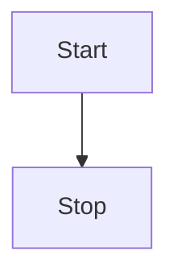
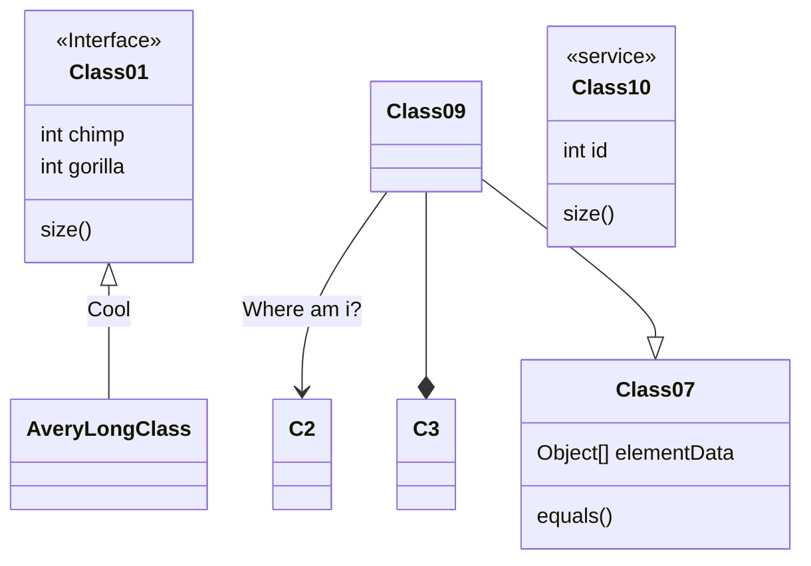

# [NOMBRE DEL PROYECTO]
### Nombre y carné de los integrantes: 

### Estado del proyecto:
### Enlace del video:
Recordar que el video debe ser público para ser visto por el profesor

```mermaid
  graph TD;
      A-->B;
      A-->C;
      B-->D;
      C-->D;
```

```mermaid
flowchart TD
    Start --> Stop
```

```mermaid
classDiagram
Class01 <|-- AveryLongClass : Cool
<<Interface>> Class01
Class09 --> C2 : Where am i?
Class09 --* C3
Class09 --|> Class07
Class07 : equals()
Class07 : Object[] elementData
Class01 : size()
Class01 : int chimp
Class01 : int gorilla
class Class10 {
  <<service>>
  int id
  size()
}
```
    
